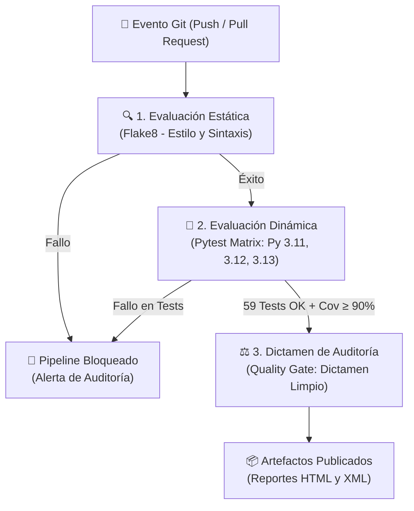

# 🎓 SisNotas UMSS — Automatización de Pruebas con GitHub Actions


> **Materia:** Evaluación y Auditoría de Sistemas (Gestión II-2026)  
> **Docente:** Ing. Jimmy Villarroel Novillo (J.V.N.)  
> **Universidad:** Universidad Mayor de San Simón (UMSS) — Cochabamba, Bolivia  
> **Equipo:** **Grupo 15**  
> * **Bryan Vásquez Maldonado** (Líder Técnico)  
> * **Juan Adiel Butrón Agreda**  
> * **Fernando Vera Vera**  

---

## 📌 1. Descripción del Proyecto

**SisNotas UMSS** es un microservicio desarrollado en Python que implementa las reglas reales de evaluación estudiantil de la Universidad Mayor de San Simón (parciales, finales, instancias reglamentarias, control de boletas y límites de notas).

Este proyecto sirve como demostración práctica de cómo **GitHub Actions** actúa como un **Auditor Continuo de Software**, ejecutando pruebas de **Caja Negra** y **Caja Blanca** de forma automatizada mediante un pipeline de Integración Continua (CI), garantizando que ningún código defectuoso llegue a producción.

---

## 🏛️ 2. Reglas de Negocio Implementadas (Reglamento UMSS)

1. **Parciales ($1P + 2P$):** Si la suma es $\ge 51$, el estudiante **aprueba directamente**. Si es $< 51$, reprueba la etapa de parciales.
2. **Examen Final (100 pts):** Quien reprobó parciales o desea mejorar nota puede rendir el examen final. Con nota $\ge 51$ **aprueba**; con $< 51$ **reprueba**.
3. **Examen de Instancia (Controles Críticos de Auditoría):**
   * **Habilitación:** Requiere nota acumulada en parciales $\ge 26$.
   * **Comprobante de Caja:** Es obligatorio contar con la boleta de pago (10 Bs.) emitida en cajas de la facultad.
   * **Límite Semestral:** Máximo 2 exámenes de instancia por estudiante en el semestre.
   * **Techo de Calificación:** Si el estudiante aprueba en instancia ($\ge 51$), **su nota asentada es estrictamente 51**, sin importar si obtuvo una calificación superior en el examen.

---

## ⚙️ 3. Arquitectura del Pipeline de GitHub Actions

El pipeline configurado en `.github/workflows/ci.yml` ejecuta una auditoría automática en 3 etapas secuenciales:



### Componentes Clave del Flujo de Trabajo:
* **Evaluación Estática:** Inspección de código en reposo con `flake8` para detectar errores de sintaxis y complejidad ciclomática excesiva sin ejecutarlo.
* **Evaluación Dinámica:** Ejecución de 59 casos de prueba con `pytest` en matriz paralela sobre Python 3.11, 3.12 y 3.13.
* **Umbral de Calidad (*Coverage Fail-Under*):** El pipeline falla automáticamente si la cobertura de código es menor al 90% (`--cov-fail-under=90`).
* **Dictamen Final:** Emite un veredicto de auditoría formal (*Favorable/Limpio* o *Desfavorable/Adverso*) en los logs de la ejecución.

---

## 🧪 4. Distribución de la Suite de Pruebas (59 Tests)

| Bloque | Enfoque Evaluativo | Técnica Aplicada | Cantidad |
| :---: | :--- | :--- | :---: |
| **A** | Validaciones | Caja Negra: Clases de Equivalencia y Valores Límite | 23 |
| **B** | Flujo Académico | Caja Blanca: Cobertura de Caminos Básicos de McCabe | 10 |
| **C** | Reglas de Instancia | Casos de Prueba (TC) de Alto Nivel de Negocio | 12 |
| **D** | Detección de Anomalías | TC de Alto Nivel para Auditoría y Muestreo | 8 |
| **E** | Bifurcaciones Internas | Casos de Prueba (TC) de Bajo Nivel Estructural | 5 |
| | **TOTAL** | | **59 PASSED** |

---

## 🚀 5. Ejecución Local

Para clonar y ejecutar las pruebas localmente en tu entorno:

```bash
# 1. Clonar el repositorio
git clone https://github.com/TU_USUARIO_GITHUB/sisnotas_umss.git
cd sisnotas_umss

# 2. Instalar dependencias de desarrollo
pip install -r requirements-dev.txt

# 3. Ejecutar las 59 pruebas con reporte de cobertura
pytest tests/ -v --cov=src --cov-report=term-missing
```

---

## 👥 6. Información de Contacto del Equipo

* **Bryan Vásquez Maldonado** — *Líder de Desarrollo y CI/CD*
* **Juan Adiel Butrón Agreda** — *Especialista en QA y Diseño de Pruebas*
* **Fernando Vera Vera** — *Automatización y Soporte de Infraestructura*
